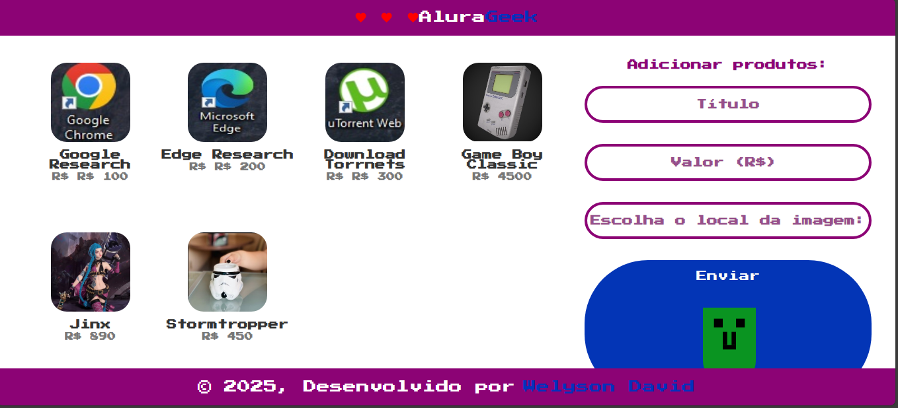

<h1>executar o json-server para carregar a vitrine   Json-server --watch ga.json</h1>
 
<h1>verificar o powershell: </h1> 
<h1>
O projeto funciona: adicionar produtos: titulo, valor e imagem e carregalos e excluilos da pagina
</h1>
<h2> 
<!-- 
$headers = @{
    "Content-Type" = "application/json"
}
$body = @{
    id = [System.DateTime]::Now.Ticks
    titulo = "Game Boy Classic"
    valor = "45"
    imagem = "./imgs/Game Boy Classic.jpg"
}
Invoke-RestMethod -Uri http://localhost:3000/produtos -Method Post -Headers $headers -Body ($body | ConvertTo-Json) 
-->
</h2>

<h1>Produzindo a loja geek</h1>

<h2>Você aplicará conceitos fundamentais como manipulação do DOM, entenderá como a web funciona e o uso dos métodos GET, POST e DELETE.</h2>    

<h2>Você lidará com promessas, consumo de APIs e a realização de requisições ao servidor (json-server). Programação assíncrona, juntamente com outros conceitos avançados de JavaScript.</h2>